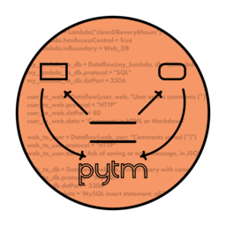

---

title: OWASP pytm
layout: col-sidebar
tags: threat-modeling threat modeling dataflow-diagram dataflow diagram python graphviz plantuml
level: 3.5
type: tool
pitch: pytm is a Pythonic framework for threat modeling. The goal of pytm is to shift threat modeling to the left, making threat modeling more automated and developer-centric

---

{: .image-right }

pytm is a Pythonic framework for threat modeling.

Define your system in Python using the elements and properties described in the pytm framework.
Based on your definition, pytm can generate, a Data Flow Diagram (DFD), a Sequence Diagram
and most important of all, threats to your system.
